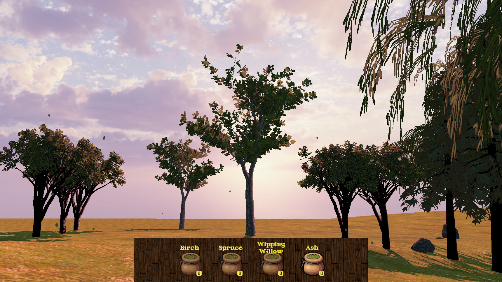
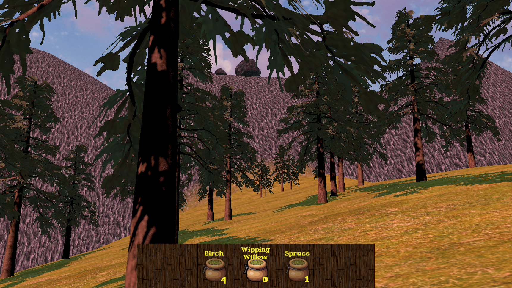

# 

Welcome to **Evergreen Valley**! This is a chill and relaxing game where the player can find new seeds and plant them to grow a forest.

## 📷 Screenshots




## 🎮 How to Play
1. [Download the installer](https://drive.google.com/file/d/1_gAi9YXoOziSm1caPqpfe06f4tCLuK61/view?usp=sharing)
2. Run the executable.
3. Follow the installation steps.
4. Enjoy!

## 🛠 Installation
```bash
# Clone the repository
git clone https://github.com/yourusername/my-awesome-game.git

# Navigate into the project directory
cd my-awesome-game

# Install dependencies
npm install  # or pip install -r requirements.txt (depending on your stack)
```

## 🤝 The team
This project was made during a 48h game jam by 2 people:

- [Jules Delrieu](https://github.com/jul339)
- [Galilée Mason](https://github.com/Blum3)

## 📜 License
This project has no licence yet lol.
